<div align="center">

# NexusDB

**A minimal document database with GraphQL API, built with TypeScript**

---

<p>


</p>
</div>

---

## Overview

NexusDB is a **minimal in-memory document database** with a **GraphQL API**, built in **TypeScript**.  
Designed for **learning database internals, query planning, and storage engines**, it’s also **extensible for future advanced features**.

**Principles:**

- Minimalism – Lightweight and easy to understand  
- Extensibility – Indexing & transactions can be added easily  
- Learning-Oriented – Understand database internals clearly  

---

## Features

- In-memory document storage with **collections**  
- **GraphQL API** for CRUD operations  
- Advanced query capabilities: **filters, projections, sorting, limiting**  
- Query planner & executor architecture  
- Extensible design with placeholders for **indexes & transactions**  

---

## Quick Start

<details>
<summary>Clone & Install</summary>

```bash
git clone https://github.com/luvaary/NexusDB.git
cd NexusDB
npm install
````

</details>

<details>
<summary>Development Mode</summary>

```bash
npm run dev
```

Server runs at: `http://localhost:4000`

</details>

<details>
<summary>Production Mode</summary>

```bash
npm run build
npm start
```

</details>

---

## GraphQL API

<details>
<summary>Queries</summary>

**Get a single document**

```graphql
query {
  getDocument(collection: "users", id: "123") {
    _id
    data
  }
}
```

**List all documents**

```graphql
query {
  listDocuments(collection: "users") {
    _id
    data
  }
}
```

**Get all collections**

```graphql
query {
  getCollections
}
```

**Advanced query**

```graphql
query {
  queryDocuments(
    collection: "users",
    options: {
      filters: [
        { field: "age", operator: "gte", value: 18 },
        { field: "status", operator: "eq", value: "active" }
      ],
      projection: ["name", "email", "age"],
      sort: { field: "age", order: "desc" },
      limit: 10
    }
  ) {
    documents {
      _id
      data
    }
    stats {
      executionTime
      operationsExecuted
      documentsReturned
    }
  }
}
```

</details>

<details>
<summary>Mutations</summary>

**Create document**

```graphql
mutation {
  createDocument(
    collection: "users",
    doc: { name: "Alice", email: "alice@example.com", age: 30 }
  ) {
    _id
    data
  }
}
```

**Update document**

```graphql
mutation {
  updateDocument(
    collection: "users",
    id: "123",
    doc: { age: 31, status: "active" }
  ) {
    _id
    data
  }
}
```

**Delete document**

```graphql
mutation {
  deleteDocument(collection: "users", id: "123")
}
```

**Drop collection**

```graphql
mutation {
  dropCollection(collection: "users")
}
```

</details>

---

## Architecture

```mermaid
flowchart LR
    A[GraphQL API] --> B[Query Planner]
    B --> C[Query Executor]
    C --> D[Storage Engine]
    D --> E[Document Store]

    click A "https://github.com/luvaary/NexusDB/tree/main/src/graphql" "GraphQL Layer"
    click B "https://github.com/luvaary/NexusDB/tree/main/src/query/planner.ts" "Planner"
    click C "https://github.com/luvaary/NexusDB/tree/main/src/query/executor.ts" "Executor"
    click D "https://github.com/luvaary/NexusDB/tree/main/src/storage/engine.ts" "Storage Engine"
    click E "https://github.com/luvaary/NexusDB/tree/main/src/storage/documentStore.ts" "Document Store"

    style A fill:#0a0e14,stroke:#ff79c6,stroke-width:2px
    style B fill:#0a0e14,stroke:#ff79c6,stroke-width:2px
    style C fill:#0a0e14,stroke:#ff79c6,stroke-width:2px
    style D fill:#0a0e14,stroke:#ff79c6,stroke-width:2px
    style E fill:#0a0e14,stroke:#ff79c6,stroke-width:2px
```

<details>
<summary>Animated Flow</summary>



</details>

---

## Supported Query Operators

| Operator   | Description               |
| ---------- | ------------------------- |
| `eq`       | Equal to                  |
| `ne`       | Not equal to              |
| `gt`       | Greater than              |
| `gte`      | Greater than or equal to  |
| `lt`       | Less than                 |
| `lte`      | Less than or equal to     |
| `in`       | Value in array            |
| `contains` | String contains substring |

---

## Project Structure

<details>
<summary>Structure</summary>

```
NexusDB/
├── src/
│   ├── storage/
│   ├── query/
│   └── graphql/
├── examples/
├── tests/
├── package.json
├── tsconfig.json
├── vite.config.ts
└── README.md
```

</details>

---

## Philosophy

* Minimalistic & readable code
* Educational clarity over cleverness
* Extensible for future enhancements

---

## Contributing

* Write **clean, readable, maintainable code**
* Detailed pull requests
* All contributions welcome

Repository: [GitHub](https://github.com/luvaary/NexusDB)

---

## License

MIT License – See `LICENSE`

---

## Version

`0.1.0`

```

---

